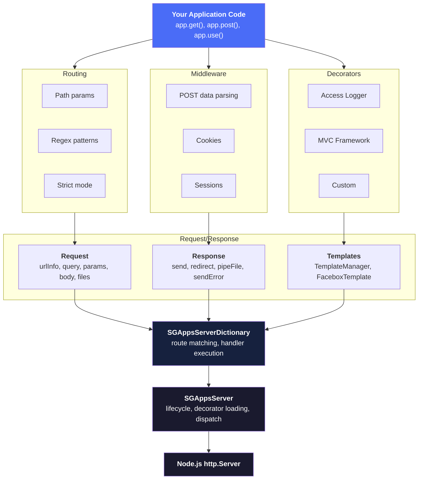
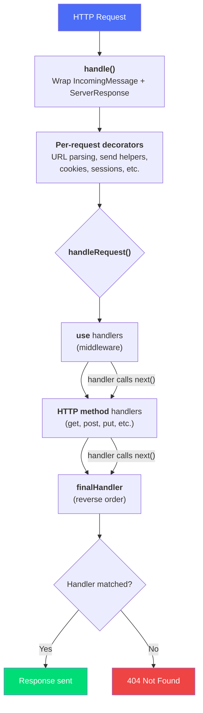
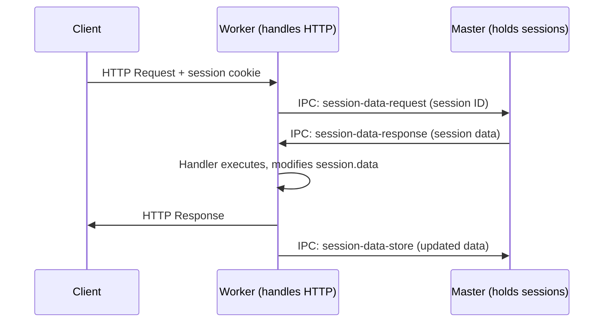

# Architecture Overview

## Design Philosophy

**SGApps Server** is built on three principles:

1. **Decorator-based extension** -- the server's capabilities are composed from decorator functions that run at startup (initialization) and per-request (decoration). This makes the architecture modular and extensible.

2. **Express-like familiarity** -- route registration uses `get()`, `post()`, `use()` with `(req, res, next)` handlers, so the learning curve is minimal for anyone who has used Express.

3. **Cluster-aware by default** -- session management works across Node.js cluster workers transparently, with automatic master/worker synchronization.

## How It Fits Together



## Core Concepts

### Request Lifecycle

When a request arrives, it flows through these stages:



### Decorator System

Decorators are functions called in two phases:

**Phase 1: Initialization** (once at startup, `request === null && response === null`)
```js
function MyDecorator(request, response, server, callback) {
    if (request === null && response === null) {
        // Add properties to server
        server.MyFeature = new MyFeature();
        callback();
        return;
    }
    // Phase 2: per-request
    request.myHelper = () => { /* ... */ };
    callback();
}
```

**Phase 2: Per-request** (every incoming request)
- Extends `request` and `response` with additional methods/properties
- Runs before any route handlers execute

### Built-in Decorators (loaded in order)

| Order | Decorator | What It Adds |
|-------|-----------|-------------|
| 1 | request-url | `getMountUpdatedUrl()` on request |
| 2 | response-send | `send()`, `sendStatusCode()` on response |
| 3 | response-error | `sendError()` on response |
| 4 | response-redirect | `redirect()` on response |
| 5 | response-pipe-file | `pipeFile()` on response (range requests) |
| 6 | response-template | `TemplateManager` on server |
| 7 | request-postdata | `body`, `files`, `postData` on request |
| 8 | request-cookie | `cookies` on request, `CookiesManager` on server |
| 9 | request-session | `session` on request, `SessionManager` on server |
| 10 | response-pipe-file-static | `pipeFileStatic()` on response (ETag, compression) |

### Route Matching

Routes are stored in `SGAppsServerDictionary` instances -- one per HTTP method plus `use` (middleware) and `_finalHandler`:

```
_requestListeners = {
    use:           Dictionary (runs first for all requests)
    get:           Dictionary
    post:          Dictionary
    put:           Dictionary
    delete:        Dictionary
    head:          Dictionary
    options:       Dictionary
    patch:         Dictionary
    trace:         Dictionary
    connect:       Dictionary
    _finalHandler: Dictionary (runs last, in reverse order)
}
```

Within each dictionary, handlers execute in registration order. Each handler calls `next()` to pass control to the next matching handler.

### Handler Execution

```js
app.get('/api/users',
    function authMiddleware(req, res, next) {
        // Handler 1: check auth
        if (!req.session._confirmed) {
            return res.sendError(Error('Unauthorized'), { statusCode: 401 });
        }
        next(); // pass to next handler
    },
    function getUsers(req, res) {
        // Handler 2: send response
        res.send([{ name: 'Alice' }]);
    }
);
```

Multiple handlers on the same route execute in sequence. If a handler throws an error, the server's error handler catches it.

## Cluster Support

The `SessionManager` automatically synchronizes sessions between cluster workers and the master process:



Workers request session data from the master on each request and store updated data back when the response finishes. If the master doesn't respond within `workersSyncMaxDelay` (default: 200ms), the worker continues with local data.

## Next Steps

- [SGAppsServer Reference](core/sgapps-server.md) -- full API
- [Routing Patterns](routing/index.md) -- route matching details
- [Middleware](middleware/index.md) -- built-in decorators
- [Security Best Practices](guides/security.md) -- hardening your app
- [Error Handling](guides/error-handling.md) -- error propagation flow
- [Production Deployment](guides/production-deployment.md) -- cluster, nginx, PM2
- [Troubleshooting](guides/troubleshooting.md) -- common problems and solutions
