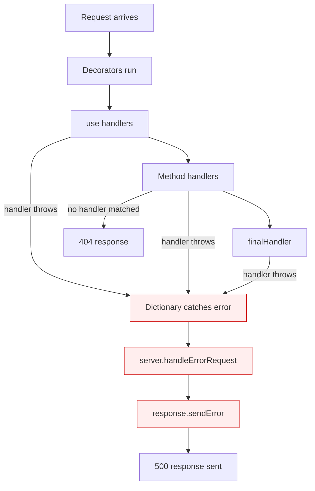

# Error Handling

How errors propagate through SGApps Server, how to catch them, and how to build custom error pages.

## Error Flow



> [!NOTE]
> Errors thrown inside handlers are caught automatically by the dictionary's `run()` method. You don't need try/catch in every handler -- the framework catches unhandled exceptions.

## How Errors Propagate

### Stage 1: Handler Throws

When a handler throws an exception, the `SGAppsServerDictionary` catches it:

```javascript
app.get('/danger', function (req, res) {
    throw new Error('Something broke'); // caught by the framework
});
// Result: 500 response with message "Something broke"
```

The error is logged via `server.logger.error()` and passed to `handleErrorRequest()`.

### Stage 2: handleErrorRequest()

The default implementation sends a 500 error:

```javascript
// This is what the framework does by default:
SGAppsServer.prototype.handleErrorRequest = function (request, response, err) {
    response.sendError(err || Error('unknown error'), {
        statusCode: 500
    });
};
```

### Stage 3: sendError()

Writes the error message to the response:

```javascript
// response.sendError(error, { statusCode: 500 })
// Sets response status code and status message
// Writes error.message as the response body
// Calls response.end()
```

## Customizing Error Handling

### Override handleErrorRequest

Replace the default error handler with your own:

```javascript
app.handleErrorRequest = function (request, response, err) {
    app.logger.error('Unhandled error:', err);

    if (app.TemplateManager.templateExists('error-500')) {
        app.TemplateManager.render(response, 'error-500', {
            title: 'Server Error',
            message: app._options.debug ? err.message : 'Internal server error',
            stack: app._options.debug ? err.stack : null
        });
    } else {
        response.sendError(err, { statusCode: 500 });
    }
};
```

### Custom 404 Pages

Use `finalHandler()` to catch unmatched routes:

```javascript
app.finalHandler('/*', function (req, res) {
    if (app.TemplateManager.templateExists('error-404')) {
        app.TemplateManager.render(res, 'error-404', {
            title: 'Not Found',
            path: req.urlInfo.pathname
        });
    } else {
        res.send('<h1>404 - Page Not Found</h1>', { statusCode: 404 });
    }
});
```

### Error Handling in Handler Chains

When multiple handlers are chained, an error in one stops the chain:

```javascript
app.get('/api/data',
    function validate(req, res, next) {
        if (!req.query.token) {
            // Option 1: send error directly (stops the chain)
            return res.sendError(new Error('Token required'), { statusCode: 401 });
        }
        next();
    },
    function process(req, res) {
        // Only runs if validate called next()
        res.send({ data: 'secret' });
    }
);
```

### Async Error Handling

For async operations, catch errors and call `sendError()`:

```javascript
app.get('/api/users', function (req, res) {
    fetchUsersFromDb(function (err, users) {
        if (err) {
            app.logger.error('Database error:', err);
            return res.sendError(new Error('Failed to load users'), { statusCode: 500 });
        }
        res.send(users);
    });
});
```

For Promise-based code:

```javascript
app.get('/api/users', function (req, res) {
    fetchUsers()
        .then(function (users) {
            res.send(users);
        })
        .catch(function (err) {
            app.logger.error('Database error:', err);
            res.sendError(new Error('Failed to load users'), { statusCode: 500 });
        });
});
```

## Error Response Patterns

### JSON API Errors

```javascript
function apiError(res, message, statusCode) {
    res.send({
        error: {
            message: message,
            status: statusCode
        }
    }, { statusCode: statusCode });
}

app.get('/api/users/:id', function (req, res) {
    var user = findUser(req.params.id);
    if (!user) return apiError(res, 'User not found', 404);
    res.send(user);
});
```

### HTML Error Pages

```javascript
app.handleErrorRequest = function (request, response, err) {
    var statusCode = 500;
    var html = '<html><body>' +
        '<h1>' + statusCode + ' - Server Error</h1>' +
        '<p>' + (app._options.debug ? err.message : 'An error occurred') + '</p>' +
        '</body></html>';
    response.send(html, { statusCode: statusCode });
};
```

### Different Errors for Different Content Types

```javascript
function handleError(req, res, err, statusCode) {
    var accept = req.request.headers.accept || '';

    if (accept.indexOf('application/json') !== -1) {
        res.send({ error: err.message }, { statusCode: statusCode });
    } else {
        res.send('<h1>' + statusCode + '</h1><p>' + err.message + '</p>', {
            statusCode: statusCode
        });
    }
}
```

## Debug Mode

When `debug: true` (default), the framework provides extra error information:

```javascript
const app = new SGAppsServer({
    debug: true,                              // enable debug logging
    _DEBUG_MAX_HANDLER_EXECUTION_TIME: 500,   // warn after 500ms
    _DEBUG_REQUEST_HANDLERS_STATS: true        // log timing per handler
});
```

> [!WARNING]
> Always set `debug: false` in production. Debug mode logs stack traces and internal paths that could aid attackers.

```javascript
// Production
const app = new SGAppsServer({ debug: false });
```

## Error Handling Checklist

| Pattern | When to Use |
|---|---|
| `res.sendError(err, { statusCode })` | Quick error response |
| `res.send(data, { statusCode })` | Structured JSON error |
| Override `handleErrorRequest()` | Global custom error pages |
| `app.finalHandler('/*', handler)` | Custom 404 page |
| `try/catch` in handler | Sync operations that might fail |
| `.catch()` on Promises | Async operations |
| Callback error check | Node.js callback-style async |

---

## Related

- [Response Reference](../networking/response.md) -- `sendError()`, `send()` methods
- [SGAppsServer Reference](../core/sgapps-server.md) -- `handleErrorRequest()` method
- [Security Best Practices](../guides/security.md) -- error information disclosure
