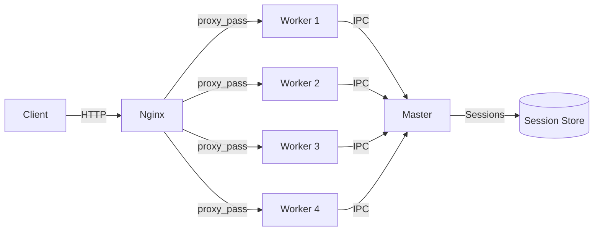

# Production Deployment

How to deploy SGApps Server for production: cluster mode, reverse proxy, process management, and operational best practices.

## Production Checklist

| Item | Setting | Why |
|---|---|---|
| Debug mode | `debug: false` | Suppresses verbose logging and stack traces |
| Cookie secret | Strong random string | Prevents cookie forgery |
| Session lifetime | 1800 or less | Limits exposure window |
| HTTPS | nginx reverse proxy | Encrypts all traffic |
| Process manager | PM2 or systemd | Auto-restart on crash |
| Cluster mode | 2-4 workers | Utilizes multiple CPU cores |
| Access logging | Enabled with rotation | Monitoring and forensics |
| POST size limits | Explicit per-route | Prevents denial-of-service |

## Production Configuration

```javascript
const { SGAppsServer } = require('sgapps-server');
const AccessLogger = require('sgapps-server/decorators/access-logger');

const app = new SGAppsServer({
    debug: false,
    decorators: [AccessLogger],
    _DEBUG_MAX_HANDLER_EXECUTION_TIME: 1000,
    _DEBUG_REQUEST_HANDLERS_STATS: false,
    _REQUEST_FORM_PARAMS_DEEP_PARSE: true
});

app.whenReady.then(() => {
    // Security
    app.CookiesManager.COOKIES_KEY = process.env.COOKIE_SECRET || 'change-me';
    app.SessionManager._options.cookie = 'ssid';
    app.SessionManager._options.SESSION_LIFE = 1800; // 30 minutes

    // Access logging
    app.AccessLogger.combined = true;
    app.AccessLogger.logsIncludeHostname = true;
    app.AccessLoggerPaths['default'] = {
        isEnabled: true,
        path: 'logs/{year}/{month}/access-{worker-id}.log'
    };

    // Routes
    app.get('/', function (req, res) {
        res.send({ status: 'ok' });
    });

    app.server().listen(process.env.PORT || 8080, () => {
        app.logger.log('Server started on port ' + (process.env.PORT || 8080));
    });
}, app.logger.error);
```

> [!ATTENTION]
> Never hardcode secrets in source files. Use environment variables (`process.env.COOKIE_SECRET`) and a `.env` file that is excluded from version control.

## Cluster Mode

Use all available CPU cores with automatic session synchronization:

```javascript
const cluster = require('cluster');
const os = require('os');
const { SGAppsServer } = require('sgapps-server');

var WORKERS = parseInt(process.env.WORKERS) || os.cpus().length;

if (cluster.isPrimary) {
    console.log('Master ' + process.pid + ': starting ' + WORKERS + ' workers');

    for (var i = 0; i < WORKERS; i++) {
        cluster.fork();
    }

    cluster.on('exit', function (worker, code, signal) {
        console.log('Worker ' + worker.process.pid + ' died, restarting...');
        cluster.fork();
    });
} else {
    var app = new SGAppsServer({ debug: false });

    // ... routes ...

    app.whenReady.then(() => {
        app.server().listen(8080, () => {
            console.log('Worker ' + process.pid + ' listening');
        });
    });
}
```



## Nginx Reverse Proxy

### Basic Configuration

```nginx
upstream sgapps_backend {
    server 127.0.0.1:8080;
    keepalive 64;
}

server {
    listen 443 ssl http2;
    server_name myapp.com;

    ssl_certificate     /etc/letsencrypt/live/myapp.com/fullchain.pem;
    ssl_certificate_key /etc/letsencrypt/live/myapp.com/privkey.pem;

    location / {
        proxy_pass http://sgapps_backend;
        proxy_http_version 1.1;
        proxy_set_header Host $host;
        proxy_set_header X-Real-IP $remote_addr;
        proxy_set_header X-Forwarded-For $proxy_add_x_forwarded_for;
        proxy_set_header X-Forwarded-Proto $scheme;
        proxy_set_header Connection "";
    }
}

# Redirect HTTP to HTTPS
server {
    listen 80;
    server_name myapp.com;
    return 301 https://$host$request_uri;
}
```

### With Multiple Workers (load balancing)

```nginx
upstream sgapps_backend {
    # Sticky sessions via IP hash (ensures same client hits same worker)
    ip_hash;
    server 127.0.0.1:8080;
    server 127.0.0.1:8081;
    server 127.0.0.1:8082;
    server 127.0.0.1:8083;
    keepalive 64;
}
```

> [!TIP]
> With SGApps Server's built-in cluster session sync, you don't strictly need `ip_hash`. Sessions work correctly across any worker. But `ip_hash` reduces IPC overhead since most requests hit the same worker.

## PM2 Process Manager

### ecosystem.config.js

```javascript
module.exports = {
    apps: [{
        name: 'sgapps-server',
        script: 'server.js',
        instances: 'max',         // use all CPU cores
        exec_mode: 'cluster',
        env: {
            NODE_ENV: 'production',
            PORT: 8080,
            COOKIE_SECRET: 'your-production-secret'
        },
        max_memory_restart: '512M',
        log_file: 'logs/pm2-combined.log',
        error_file: 'logs/pm2-error.log',
        out_file: 'logs/pm2-out.log',
        merge_logs: true
    }]
};
```

```bash
# Start
pm2 start ecosystem.config.js

# Monitor
pm2 monit

# Reload (zero-downtime)
pm2 reload sgapps-server

# Logs
pm2 logs sgapps-server
```

> [!NOTE]
> When using PM2 cluster mode, SGApps Server's session IPC sync works automatically -- PM2's cluster is built on the same `cluster` module.

## Systemd Service

### /etc/systemd/system/sgapps-server.service

```ini
[Unit]
Description=SGApps Server
After=network.target

[Service]
Type=simple
User=www-data
WorkingDirectory=/var/www/myapp
ExecStart=/usr/bin/node server.js
Restart=on-failure
RestartSec=5
Environment=NODE_ENV=production
Environment=PORT=8080
Environment=COOKIE_SECRET=your-production-secret

# Security hardening
NoNewPrivileges=true
ProtectSystem=strict
ReadWritePaths=/var/www/myapp/logs

[Install]
WantedBy=multi-user.target
```

```bash
sudo systemctl enable sgapps-server
sudo systemctl start sgapps-server
sudo systemctl status sgapps-server
sudo journalctl -u sgapps-server -f
```

## Graceful Shutdown

Handle SIGTERM for clean shutdown:

```javascript
function gracefulShutdown() {
    app.logger.log('Shutting down gracefully...');
    app.server().close(function () {
        app.logger.log('Server closed');
        process.exit(0);
    });

    // Force shutdown after 10 seconds
    setTimeout(function () {
        app.logger.error('Forced shutdown after timeout');
        process.exit(1);
    }, 10000);
}

process.on('SIGTERM', gracefulShutdown);
process.on('SIGINT', gracefulShutdown);
```

## Log Rotation

The access logger's path templates handle date-based rotation automatically:

```javascript
app.AccessLoggerPaths['default'] = {
    isEnabled: true,
    path: 'logs/{year}/{month}/access-{worker-id}.log'
};
```

This creates files like:
```
logs/2024/3/access-master.log
logs/2024/3/access-1.log
logs/2024/4/access-master.log   # new month = new file
```

For external log rotation (logrotate), use:

```
/var/www/myapp/logs/**/*.log {
    daily
    rotate 30
    compress
    delaycompress
    missingok
    notifempty
    copytruncate
}
```

## Health Check Endpoint

```javascript
var startTime = Date.now();

app.get('/health', function (req, res) {
    res.send({
        status: 'ok',
        uptime: Math.floor((Date.now() - startTime) / 1000),
        pid: process.pid,
        memory: Math.floor(process.memoryUsage().rss / 1024 / 1024) + 'MB'
    });
});
```

Use this with load balancers, monitoring tools, or Docker health checks.

---

## Related

- [Cluster Deployment Use Case](../use-cases/cluster-deployment.md) -- full cluster example
- [Access Logging Use Case](../use-cases/access-logging.md) -- log configuration
- [Security Best Practices](../guides/security.md) -- hardening checklist
